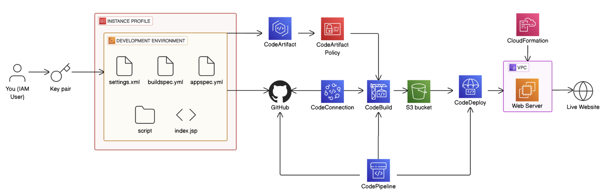

# ICL Web Project

## Overview

ICL Web Project is a Java web application built to demonstrate how code moves from development to deployment using AWS CI/CD services. The source code is hosted in the `aws-deploys-your-code` repository, while the application itself is named `icl-web-project`.

This project starts with a Maven web app and extends it with GitHub, CodeArtifact, CodeBuild, CodeDeploy, and CodePipeline to create a practical AWS deployment workflow.

## Features

- Java web application generated with Maven
- Source control with Git and GitHub
- Remote development on Amazon EC2 using VS Code Remote SSH
- Dependency management with AWS CodeArtifact
- Automated builds with AWS CodeBuild
- EC2 deployments with AWS CodeDeploy
- End-to-end pipeline support with AWS CodePipeline

## Tech Stack

| Category | Tools |
|---------|------|
| Language | Java 8 / Amazon Corretto 8 |
| Build Tool | Apache Maven |
| App Type | Java web application (`.war`) |
| Cloud | AWS |
| Compute | Amazon EC2 |
| Source Control | Git, GitHub |
| Artifact Repository | AWS CodeArtifact |
| Build Service | AWS CodeBuild |
| Deployment Service | AWS CodeDeploy |
| Pipeline | AWS CodePipeline |
| Editor | VS Code Remote SSH |

## Setup

### Prerequisites

- AWS account
- GitHub account
- Java 8 / Amazon Corretto 8
- Apache Maven
- Git
- An EC2 instance for development or deployment

### Clone the repository

```bash
git clone https://github.com/NikhilDesai11/aws-deploys-your-code.git
cd aws-deploys-your-code
```

### Install dependencies

```bash
mvn clean install
```

## Environment Variables

This project uses AWS-specific values during package resolution and deployment.

| Variable | Description |
|---------|-------------|
| `CODEARTIFACT_AUTH_TOKEN` | Temporary token used by Maven to access AWS CodeArtifact |
| `AWS_REGION` | AWS region where build and deployment resources are created |
| `AWS_ACCOUNT_ID` | AWS account ID used in CodeArtifact authentication commands |

Example:

```bash
export CODEARTIFACT_AUTH_TOKEN=$(aws codeartifact get-authorization-token \
  --domain nextwork \
  --domain-owner YOUR_AWS_ACCOUNT_ID \
  --region YOUR_AWS_REGION \
  --query authorizationToken \
  --output text)
```

## Run Locally

Build the project locally with Maven:

```bash
mvn clean package
```

If the project uses a custom Maven configuration for CodeArtifact:

```bash
mvn -s settings.xml clean package
```

The packaged artifact is generated in `target/`.

## Scripts

| File | Purpose |
|------|---------|
| `buildspec.yml` | Defines the CodeBuild workflow for install, auth, test, and package steps |
| `appspec.yml` | Defines CodeDeploy lifecycle hooks and file mappings |
| `run-tests.sh` | Runs validation or test commands during the build |
| `scripts/installdependencies.sh` | Installs server-side dependencies on the target EC2 instance |
| `scripts/startserver.sh` | Starts the application server after deployment |
| `scripts/stopserver.sh` | Stops the running server before deployment |

## API / Architecture

This project is a server-rendered Java web app, not an API-first backend.

### Architecture Diagram

The diagram below shows how code moves from the development environment through GitHub, AWS CI/CD services, and finally to the EC2-hosted web server and live website.



### Deployment flow

1. Code is pushed to GitHub.
2. CodePipeline detects the change.
3. CodeBuild pulls the source and runs `buildspec.yml`.
4. Maven resolves dependencies and packages the app.
5. Build artifacts are stored for deployment.
6. CodeDeploy uses `appspec.yml` and deployment scripts to release the app to EC2.

## Folder Structure

```text
aws-deploys-your-code/
├── src/
│   └── main/
│       └── webapp/
│           └── index.jsp
├── target/
├── scripts/
│   ├── installdependencies.sh
│   ├── startserver.sh
│   └── stopserver.sh
├── buildspec.yml
├── appspec.yml
├── run-tests.sh
├── pom.xml
├── settings.xml
├── README.md
└── LICENSE
```

## Deployment

The project is designed for AWS-based deployment using CodeBuild, CodeDeploy, and CodePipeline.

CodeBuild handles packaging, CodeDeploy handles release steps on EC2, and CodePipeline ties the full flow together from source commit to deployment.

## Contributing

1. Fork the repository.
2. Create a feature branch.
3. Keep changes focused and reviewable.
4. Test before opening a pull request.
5. Use clear commit messages.

## License

Licensed under the MIT License. See the `LICENSE` file for details.